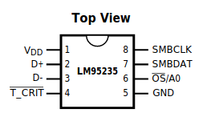
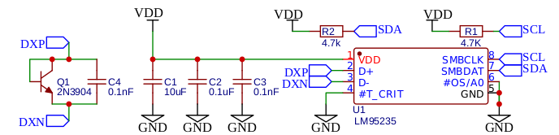

# LM95235 Arduino Library

This is a simple Arduino library for interfacing to TI's LM95235 ±0.75°C remote & local temperature sensor.
The remote temperature sensor is useful for accurately providing cold junction compensation for a thermocouple measurement.

## Methods

### Constructor LM95235(I2C_address)
 
* Description: Constructor for the LM95235 device.
* Parameters: 7-bit I2C address
* Returns: None

* Example:
    ```cpp
    #define LM95235_addr 0x18 //A0 tied to ground
    LM95235 lmtemp = LM95235(LM95235_addr);
    ```

### begin() 

* Description: Wraps `Wire.begin()`.
* Parameters: None
* Returns: None
* Example: `lmtemp.begin();`

### configure()

* Description: Initializes anything ... it does a reset.
* Parameters: None
* Returns: None
* Example: `lmtemp.configure();`

### get_remote_temperature()

* Description: Read the temperature of the remote device.
* Parameters: None
* Returns: `float` temperature in celcius with resolution determined by filter `CFG2_REMOTE_FILTER_EN/CFG2_REMOTE_FILTER_DIS` status (On/EN=0.03125 C, off/DIS = 0.125 C) 
* Example: 
  ```cpp
  float remote_temperature = lmtemp.get_remote_temperature()
  ```

## Examples

You can find examples in the examples folder of this library.

## Version History
 0.1 initial commit
## More Information

The LM95235 is an 11-bit digital temperature sensor
with a 2-wire SMBus/I2C 
interface and TruTherm technology that can monitor
the temperature of a remote diode as well as its own
temperature.The LM95235 can be used to very
accurately monitor the temperature of external
devices  or a diode-connected MMBT3904 transistor.

More info is available on the products [website](https://www.ti.com/product/LM95235?qgpn=lm95235) and the [datasheet](https://www.ti.com/lit/gpn/lm95235).

## Device Registers 
| Register assignment                 | Register Address | Description | Register name                    |
| ----------------------------------- | ---------------- | ----------- | -------------------------------- |
| LM95235_REG_RW_CONFIG1              | 0x03             |             | Configuration Register 1         |
| LM95235_REG_RW_CONVERS_RATE         | 0x04             |             | Conversion Rate                  |
| LM95235_REG_W_ONE_SHOT              | 0x0F             |             | One-Shot                         |
| LM95235_REG_RW_CONFIG2              | 0xBF             |             | Configuration Register 2         |
| LM95235_REG_RW_REMOTE_OFFH          | 0x11             |             | Remote Offset High Byte          |
| LM95235_REG_RW_REMOTE_OFFL          | 0x12             |             | Remote Offset Low Byte           |
| LM95235_REG_R_STATUS1               | 0x02             |             | Status Register 1                |
| LM95235_REG_R_STATUS2               | 0x33             |             | Status Register 2                |
| LM95235_REG_RW_REMOTE_OS_LIMIT      | 0x07             |             | Remote OS Limit                  |
| LM95235_REG_RW_LOCAL_OS_TCRIT_LIMIT | 0x20             |             | Local Shared OS and T_Crit Limit |
| LM95235_REG_RW_REMOTE_TCRIT_LIMIT   | 0x19             |             | Remote T_Crit Limit              |
| LM95235_REG_RW_COMMON_HYSTERESIS    | 0x21             |             | Common Hysteresis                |
| LM95235_REG_R_LOCAL_TEMPH_S         | 0x00             |             | Local Temp MSB                   |
| LM95235_REG_R_LOCAL_TEMPL_S         | 0x30             |             | Local Temp LSB                   |
| LM95235_REG_R_REMOTE_TEMPH_S        | 0x01             |             | Remote Temp MSB – Signed         |
| LM95235_REG_R_REMOTE_TEMPL_S        | 0x10             |             | Remote Temp LSB – Signed         |
| LM95235_REG_R_REMOTE_TEMPH_U        | 0x31             |             | Remote Temp MSB – Unsigned       |
| LM95235_REG_R_REMOTE_TEMPL_U        | 0x32             |             | Remote Temp LSB – Unsigned       |
| LM95235_REG_R_MAN_ID                | 0xFE             |             | Manufacturer ID                  |
| LM95235_REG_R_CHIP_ID               | 0xFF             |             | Revision ID                      |

## Device Specific bitfields 

### Configuration Register 1
| Register assignment   | Bit field Address | Description |
| --------------------- | ----------------- | ----------- |
| CFG_STOP              | 0x40              |             |
| CFG_REMOTE_TCRIT_MASK | 0x10              |             |
| CFG_REMOTE_OS_MASK    | 0x08              |             |
| CFG_LOCAL_TCRIT_MASK  | 0x04              |             |
| CFG_LOCAL_OS_MASK     | 0x02              |             |

### Configuration Register 2
| Register assignment    | Bit field Address | Description |
| ---------------------- | ----------------- | ----------- |
| CFG2_OS_A0             | 0x40              |             |
| CFG2_DIODE_FAULT_OS    | 0x20              |             |
| CFG2_DIODE_FAULT_TCRIT | 0x10              |             |
| CFG2_REMOTE_TT         | 0x08              |             |
| CFG2_REMOTE_FILTER_DIS | 0x00              |             |
| CFG2_REMOTE_FILTER_EN  | 0x06              |             |

### Conversion Rate Register
| Register assignment | Bit field Address | Description |
| ------------------- | ----------------- | ----------- |
| RATE_CR0063         | 0x00              |             |
| RATE_CR0364         | 0x01              |             |
| RATE_CR1000         | 0x02              |             |
| RATE_CR2500         | 0x03              |             |

### Status Register 1
| Register assignment | Bit field Address | Description | Register name |
| ------------------- | ----------------- | ----------- | ------------- |
| STATUS1_ROS         | 0x10              |             |               |
| STATUS1_DIODE_FAULT | 0x04              |             |               |
| STATUS1_RTCRIT      | 0x02              |             |               |
| STATUS1_LOC         | 0x01              |             |               |

### IDENTIFICATION REGISTERS
| Register assignment | Bit field Address | Description | Register name             |
| ------------------- | ----------------- | ----------- | ------------------------- |
| MANUFACTURER_ID     | 0x01              |             | Manufacturers ID Register |
| LM95235_REVISION    | 0xB1              |             | Revision ID Register      |


## Pinout


| Pin Number | Pin Name | Type                 | Description                                                                                                |
| ---------- | -------- | -------------------- | ---------------------------------------------------------------------------------------------------------- |
| 1          | VDD      | Power                | Device power supply. Add bypass capacitor of 10 μF, 0.1 μF and 100 pF. Place 100 pF closest to device pin. |
| 2          | D+       | Analog Input/Output  | Positive input from the thermal diode.                                                                     |
| 3          | D-       | Analog Input/Output  | Negative input from the thermal diode.                                                                     |
| 4          | T_CRIT   | Digital Output       | Critical temperature output. Open-drain output requires pull-up resistor. Active low.                      |
| 5          | GND      | Ground               | Device ground.                                                                                             |
| 6          | OS/A0    | Digital Input/Output | Address input. Can be tied to VDD, GND, or VDD/2.                                                          |
| 7          | SMBDAT   | Digital Input/Output | SMBus/I2C interface data pin. Open-drain output requires pull-up resistor (e.g. 4.7 kOhm).                 |
| 8          | SMBCLK   | Digital Input        | SMBus/I2C interface  clock pin.  Open-drain output requires pull-up resistor (e.g. 4.7 kOhm).              |

## Programmable I2C address

| Pin Name | Setting | I2C Address |
| -------- | ------- | ----------- |
| OS/A0    | GND     | 0x18        |
| OS/A0    | VDD/2   | 0x29        |
| OS/A0    | VDD     | 0x4C        |

## Wiring Schematic


